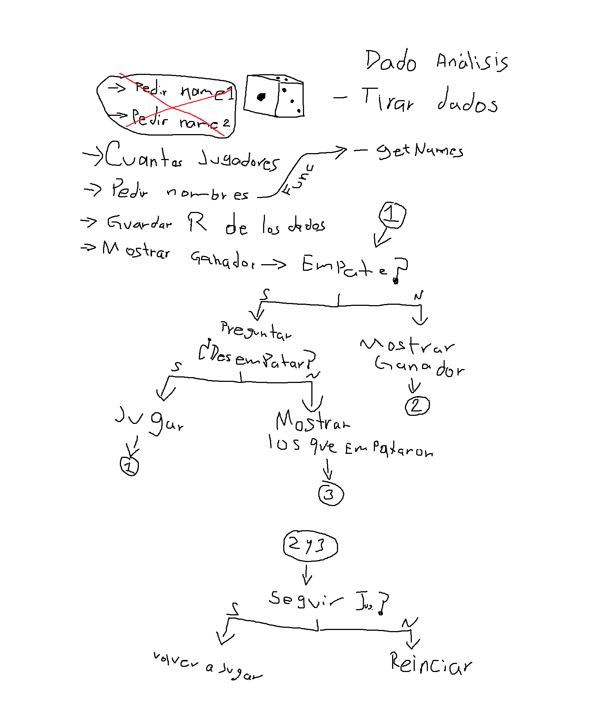

# C Dice Game 🎲

A command-line dice game developed in **C** as part of my journey to learn the C programming language.

The game supports multiple players, allows each player to roll a die, compares their results, and determines the winner. In case of a tie, the players can choose to roll again to break the tie.

## Features

* Support for multiple players
* Custom player names
* Random dice rolls
* Visual dice faces using Unicode characters
* Rolling animation
* Winner detection
* Tie detection
* Tie-breaking rounds
* Input validation
* Option to play again
* Interactive command-line interface

## Game Rules

1. The player chooses how many people will participate.
2. Each player enters their name.
3. Every player rolls a six-sided die.
4. The result of each roll is displayed.
5. The player with the highest result wins.
6. If two or more players obtain the same highest result, the game asks whether they want to roll again.
7. The game continues until there is a winner.
8. After the game ends, players can choose whether to play again.

## Project Structure

```text
c-dice-game/
├── include/
│   └── dice_game.h
├── src/
│   └── dice_game.c
├── main.c
├── planning.png
├── .gitignore
└── LICENSE
```

## Technologies

* **C**
* **GCC**
* **Git**
* **GitHub**

## Concepts Practiced

This project was created to practice:

* Functions
* Pointers
* Arrays
* Strings
* Character arrays
* Variable Length Arrays (VLAs)
* Loops
* Conditional statements
* `switch`
* Random number generation
* `rand()`
* `srand()`
* `time()`
* `Sleep()`
* String input with `fgets()`
* String manipulation
* Input validation
* Sorting
* Copying arrays
* Header files
* Include guards
* Modular programming
* Separating declarations and implementations
* Compiling multiple source files

## Dice Visualization

The game uses Unicode characters to represent the faces of a six-sided die:

```text
⚀  ⚁  ⚂  ⚃  ⚄  ⚅
```

This provides a more visual experience while keeping the game entirely within the command line.

## Rolling Animation

A short delay is applied while rolling the dice to simulate an animation in the terminal.

The project also configures the Windows console to use UTF-8 so the Unicode dice faces can be displayed correctly.

## Compilation

Make sure you have **GCC** installed.

From the project root, compile the program with:

```bash
gcc main.c src/dice_game.c -I include -o dice_game
```

Then run it:

### Windows

```bash
./dice_game.exe
```

### Linux / macOS

```bash
./dice_game
```

> **Note:** The current implementation uses Windows-specific functionality such as `Sleep()` and console configuration. Additional changes would be required for full Linux/macOS compatibility.

## Example

```text
========================================
          C DICE GAME
========================================

How many players? 3

Player 1 name: Angel
Player 2 name: Carlos
Player 3 name: Luis

Angel rolls...
⚄

Carlos rolls...
⚂

Luis rolls...
⚅

========================================
Winner: Luis
Result: ⚅
========================================

Play again? (Y/n):
```

### Tie Example

```text
Angel rolls...
⚄

Carlos rolls...
⚄

Luis rolls...
⚂

It's a tie between:

Angel - ⚄
Carlos - ⚄

Do you want to roll again? (Y/n):
```

## Planning

The project was planned before implementation to organize the game flow and its main functions.



## Purpose

This project is part of a series of C programming projects designed to progressively improve my understanding of the language.

The main goal was to practice working with **arrays, strings, pointers, random numbers, input validation, modular programming, and more complex program flow** while building a small interactive game from scratch.

## Author

**Ángel Andrés García Arroyo**

* GitHub: [@KaliGa70](https://github.com/KaliGa70)
* LinkedIn: [KaliGa70](https://www.linkedin.com/in/kaliga70)

## License

This project is licensed under the **MIT License**. See the [LICENSE](LICENSE) file for more information.
